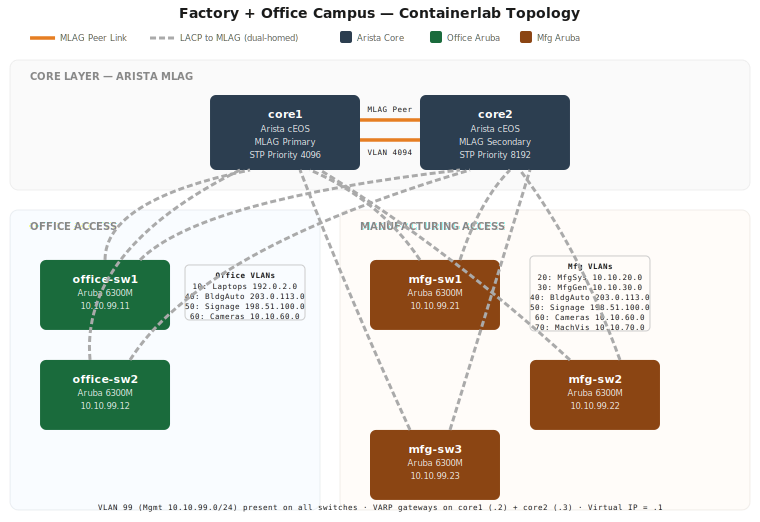

# Factory + Office Campus Network Lab

Containerlab topology modeling a mixed manufacturing and office campus network with an Arista MLAG core and Aruba 6300M CX access switches.

## Architecture

A dual Arista cEOS core provides Layer 3 gateway services via VARP (Virtual ARP), with MLAG for redundancy. Five Aruba AOS-CX access switches connect dual-homed to both core switches using LACP, which the Arista side terminates as MLAG port-channels. Two switches serve office areas and three serve the manufacturing floor, each carrying only the VLANs relevant to their role.

```
                 ┌─────────┐  MLAG Peer  ┌─────────┐
                 │  core1  │◄═══════════►│  core2  │
                 │  cEOS   │  VLAN 4094  │  cEOS   │
                 │ Pri 4096│             │ Pri 8192│
                 └──┬─┬─┬──┘             └──┬─┬─┬──┘
                    │ │ │                    │ │ │
          ┌────────┘ │ │ └───────┐ ┌────────┘ │ └────────┐
          │          │ │         │ │           │          │
     ┌────┴───┐ ┌────┴─┴──┐ ┌───┴─┴──┐ ┌─────┴──┐ ┌────┴───┐
     │office  │ │office   │ │mfg     │ │mfg     │ │mfg     │
     │  sw1   │ │  sw2    │ │  sw1   │ │  sw2   │ │  sw3   │
     │ Aruba  │ │ Aruba   │ │ Aruba  │ │ Aruba  │ │ Aruba  │
     └────────┘ └─────────┘ └────────┘ └────────┘ └────────┘
```

## VLAN Plan



| VLAN | Name | Subnet | Office | Mfg |
|------|------|--------|:------:|:---:|
| 10 | Laptops & Desktops | 192.0.2.0/24 | ✓ | |
| 20 | Mfg Systems (torque wrenches, PLCs) | 10.10.20.0/24 | | ✓ |
| 30 | Mfg General (workstations, printers) | 10.10.30.0/24 | | ✓ |
| 40 | Building Automation (HVAC, fire) | 203.0.113.0/24 | ✓ | ✓ |
| 50 | Digital Signage | 198.51.100.0/24 | ✓ | ✓ |
| 60 | Cameras | 10.10.60.0/24 | ✓ | ✓ |
| 70 | Machine Vision | 10.10.70.0/24 | | ✓ |
| 99 | Management | 10.10.99.0/24 | ✓ | ✓ |
| 4094 | MLAG Peer (core only) | 10.10.251.0/30 | — | — |

Subnets use RFC 5737 documentation prefixes (192.0.2.0/24, 198.51.100.0/24, 203.0.113.0/24) and RFC 1918 10.0.0.0/8 space.

## Gateway Addressing (VARP)

Both core switches share a virtual MAC (`00:1c:73:00:dc:01`) and a common gateway IP (`.1`) for each VLAN. Each core also has its own real IP for management and troubleshooting.

| VLAN | Virtual GW (.1) | core1 (.2) | core2 (.3) |
|------|----------------|------------|------------|
| 10 | 192.0.2.1 | 192.0.2.2 | 192.0.2.3 |
| 20 | 10.10.20.1 | 10.10.20.2 | 10.10.20.3 |
| 30 | 10.10.30.1 | 10.10.30.2 | 10.10.30.3 |
| 40 | 203.0.113.1 | 203.0.113.2 | 203.0.113.3 |
| 50 | 198.51.100.1 | 198.51.100.2 | 198.51.100.3 |
| 60 | 10.10.60.1 | 10.10.60.2 | 10.10.60.3 |
| 70 | 10.10.70.1 | 10.10.70.2 | 10.10.70.3 |
| 99 | 10.10.99.1 | 10.10.99.2 | 10.10.99.3 |

## Management Addresses

| Node | Containerlab Mgmt (OOB) | In-Band (VLAN 99) |
|------|------------------------|--------------------|
| core1 | 172.20.20.2 | 10.10.99.2 |
| core2 | 172.20.20.3 | 10.10.99.3 |
| office-sw1 | 172.20.20.11 | 10.10.99.11 |
| office-sw2 | 172.20.20.12 | 10.10.99.12 |
| mfg-sw1 | 172.20.20.21 | 10.10.99.21 |
| mfg-sw2 | 172.20.20.22 | 10.10.99.22 |
| mfg-sw3 | 172.20.20.23 | 10.10.99.23 |

## Prerequisites

**Arista cEOS** — Import the cEOS-lab container image:

```bash
docker import cEOS-lab-4.32.0F.tar ceosimage:4.32.0F
```

**Aruba AOS-CX** — Build from the OVA using vrnetlab:

```bash
git clone https://github.com/hellt/vrnetlab.git
cd vrnetlab/aruba/aoscx
# Copy your OVA, extract the VMDK
tar xvf AOS-CX_10_17_1010.ova
sudo make docker-image
# Tag for convenience
docker tag vrnetlab/aruba_arubaos-cx:<build-tag> vrnetlab/aruba_arubaos-cx:latest
```

## Deploy

```bash
sudo clab deploy -t factory-network.clab.yml
```

AOS-CX nodes take roughly 2 minutes each to boot. Monitor with:

```bash
docker logs -f clab-factory-network-mfg-sw1
```

## Connect

```bash
# Arista — SSH with no password (or admin/admin depending on cEOS version)
ssh admin@clab-factory-network-core1

# Aruba — SSH with admin/admin
ssh admin@clab-factory-network-office-sw1
```

## Destroy

```bash
sudo clab destroy -t factory-network.clab.yml
```

## File Structure

```
factory-network/
├── factory-network.clab.yml     # Containerlab topology
├── README.md
└── configs/
    ├── core1.cfg                # Arista MLAG primary — all VLANs, VARP, STP root
    ├── core2.cfg                # Arista MLAG secondary — mirrors core1
    ├── office-sw1.cfg           # Aruba office — VLANs 10,40,50,60,99
    ├── office-sw2.cfg           # Aruba office — VLANs 10,40,50,60,99
    ├── mfg-sw1.cfg              # Aruba mfg — VLANs 20,30,40,50,60,70,99
    ├── mfg-sw2.cfg              # Aruba mfg — VLANs 20,30,40,50,60,70,99
    └── mfg-sw3.cfg              # Aruba mfg — VLANs 20,30,40,50,60,70,99
```
